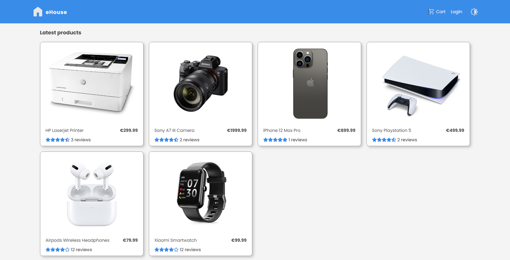
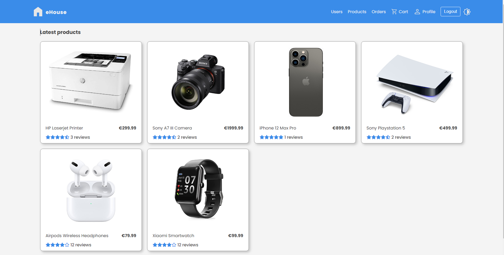
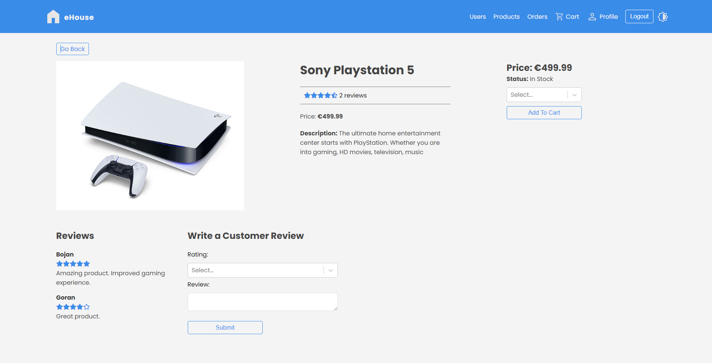
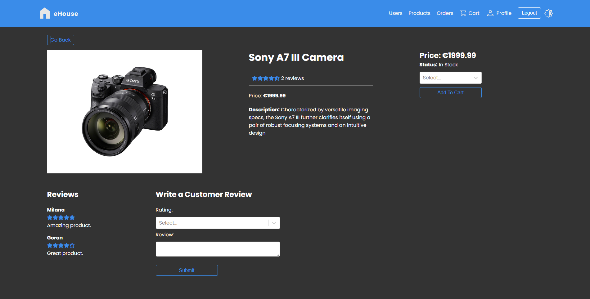
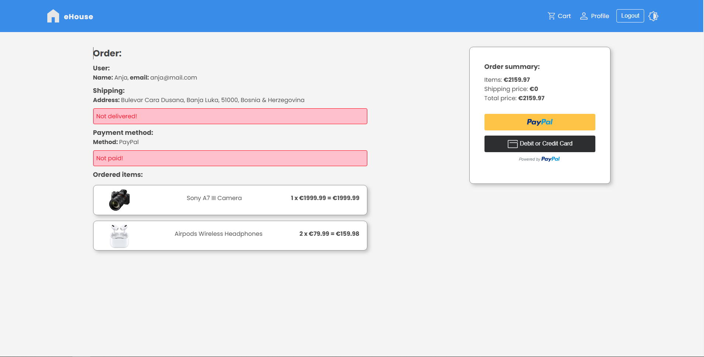

# eHouse
eHouse is a student project and full-stack web application developed in process of learning modern technologies like ReactJS, NodeJS, MongoDB, ExpressJS, React Router, React Redux Toolkit.

At eHouse web shop customer can sign up, buy electronic devices and leave a review on product. Paying for products is implemented with PayPal.
Dark theme is implemented as well, for better user experience.

State managment and design of the application will be improved in next upgrade.

